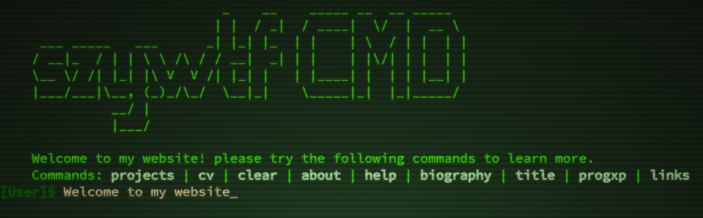

Unique design idea for a website that I use as my interactive CV!

## Features
* *Command auto-completion*: As you type, you can see suggestions of commands, pressing enter completes to the suggestion.
* *Website launcher*: Even if a command is not displayed in the help menu, some website names can be entered to open them in a new tab.
* *Thumbnail previews*: Mouseing over the project links, will display a thumbnail next to the link showing a preview of what that project is.
* *Mouse navigation*: suggested commands in the help menu, can be clicked on to enter it into the command interface.

Try it out [here](http://szy.wtf/projects/cmd)!

## Known issues and problems
* Formatting does not scale well when displayed on mobile devices
* Any information about forcing the virtual keyboard to open on mobile devices, would be useful
* After a link is clicked, pressing enter to issue another command, opens the previous link again (until the user clicks anyware but a hyperlink)
